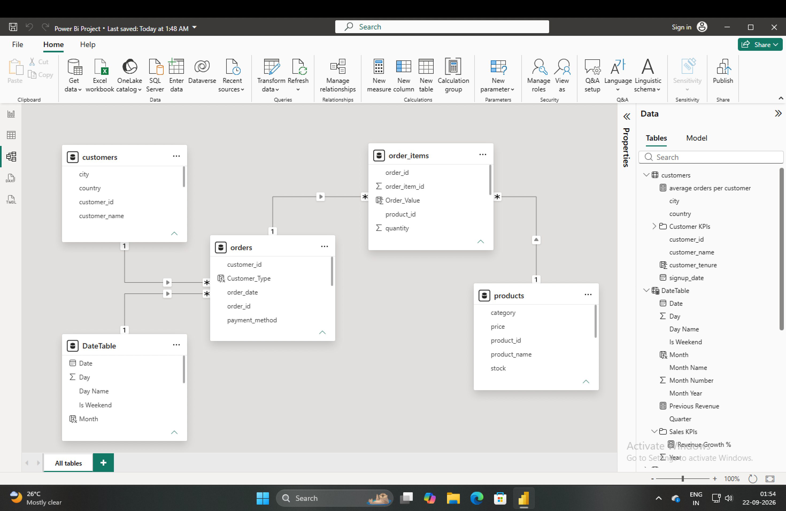
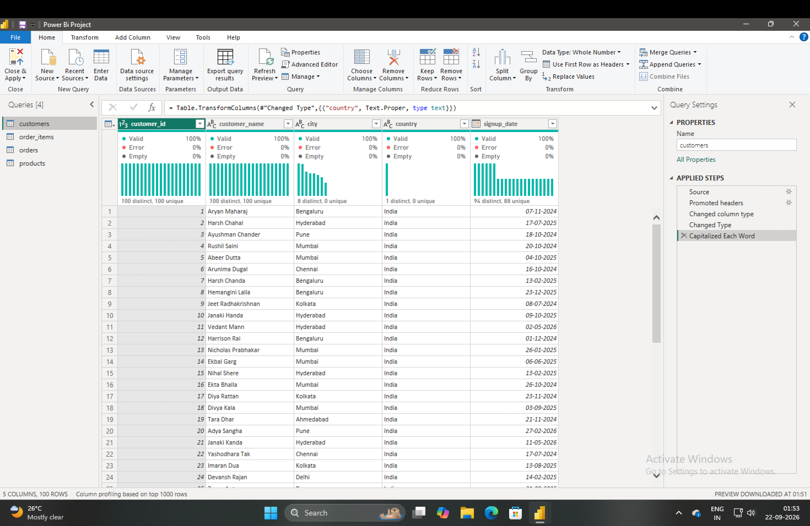
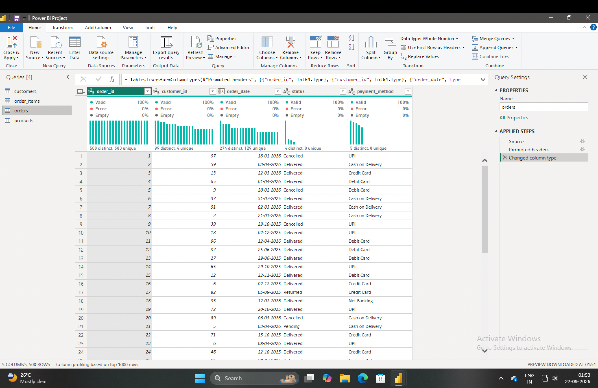
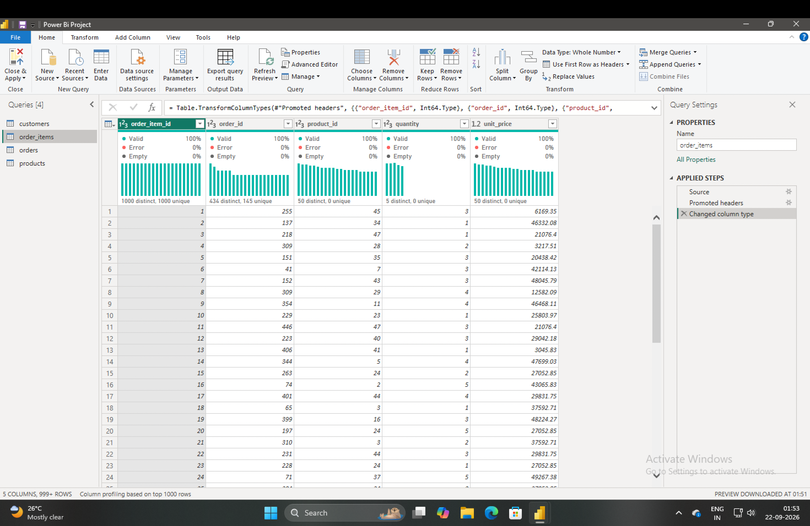
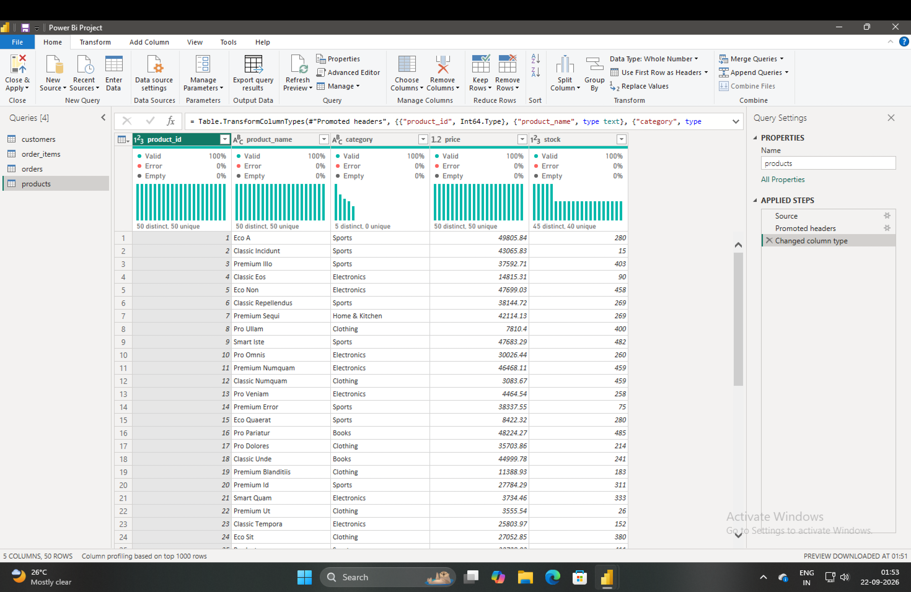

# ecommerce-sales-powerbi-analysis

An end-to-end Power BI analysis of 100 customers, 50 products, 500 orders
and 1,500 order items (May 2025 – May 2026).

## Dashboards (6 pages)
1. KPI Identification & DAX Measures
2. Sales Performance
3. Customer Analytics
4. Product & Category
5. Orders & Payment
6. Customer Value & Retention

## Key Findings
- Total revenue of ₹7.98 Cr; Electronics contributes 36.9%
- 95% repeat customer rate; 24 High-Value customers drive ~45% of revenue
- Cash on Delivery has the highest cancellation rate (14.56%)
- Mumbai has the highest city cancellation rate (17.86%)

## Files
- `Power_Bi_Project_.pbix` – Power BI report
- `dashboards.pdf` – Dashboard screenshots
- `Business_Insights.docx` – Findings
- `Business_Recommendations.docx` – Recommendations

## Data Model
Star-schema model with a date dimension:
- `customers` (1) → (*) `orders`
- `DateTable` (1) → (*) `orders`
- `orders` (1) → (*) `order_items`
- `products` (1) → (*) `order_items`

## Data Cleaning
Each table was checked for duplicate keys, orphaned foreign keys,
invalid dates and inconsistent categories.

## Tools
Power BI, DAX
 
